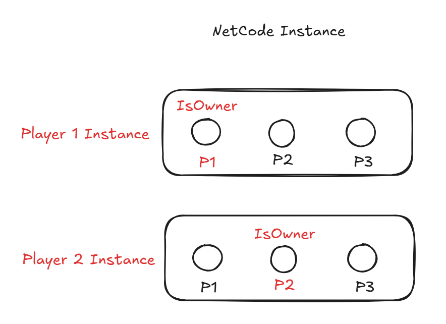

## Introduction

> **Concepte :**
> Les jeux multijoueurs sont des jeux qui se déroulent entre plusieurs instances de jeu différentes. Chaque instance possède sa propre copie du monde de jeu et ses propres comportements au sein de ce monde

--- 

## Ressources

- [Unity : Get started with Netcode for GameObjects](https://learn.unity.com/tutorial/get-started-with-netcode-for-gameobjects)
