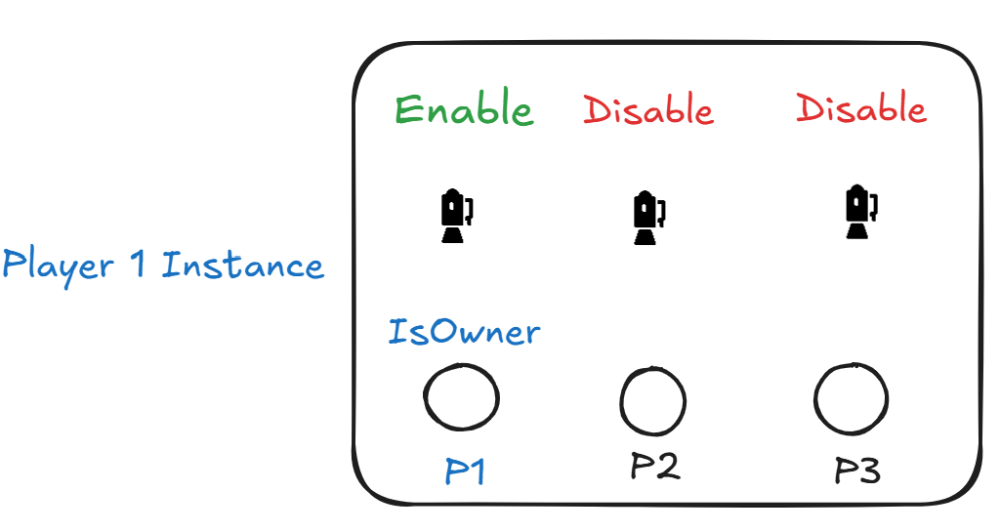
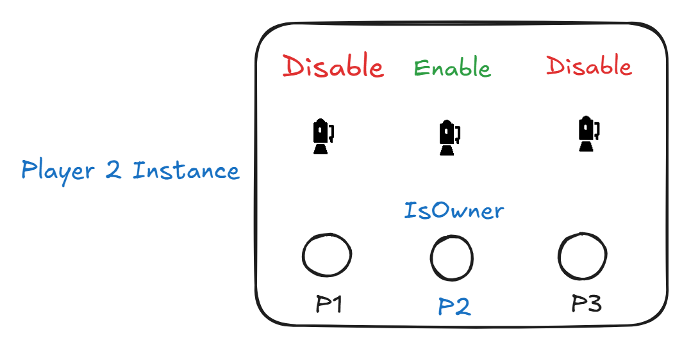

import { Code, Aside } from '@astrojs/starlight/components';

<Aside type="caution">Sur unity la dernière caméra crée devient la caméra principal.</Aside>

## Implémentation

- Un **GameObject camera** doit-être placer dans le prefab du joueur.
- Cette caméra dois-être `disable` par défaut.

#### Implémentation - Code
Au niveau du script **PlayerMovement.cs** 

<Code code="[SerializeField] private Camera _camera;" lang="csharp" title="PlayerMovement.cs" mark={['file', 'CMS']} />

Ajouter la fonction `OnNetworkSpawn()`

<Code code="
  public override void OnNetworkSpawn()
    {
        base.OnNetworkSpawn();
        if (!IsOwner) return;
        _camera.enabled = true;
    }
" lang="csharp" title="PlayerMovement.cs" mark={['file', 'CMS']} />

1. Lorsque notre GameObject (c'est-à-dire le joueur) apparaît dans la scène,
2. On vérifie s'il est bien le propriétaire de cette instance,
3. Si oui : sa caméra est activée,
4. Si non : la caméra reste désactivée.

Ainsi, le processus se déroulera de cette manière.

